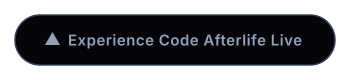

# ⚰️ Code Afterlife

<p align="center">
  
  
  
  
  
  
  
  
  <a href="./LICENSE"></a>
</p>

<p align="center">
  <strong>Build. Decay. Resurrect.</strong><br/>
  A cinematic digital afterlife for software projects. Give your abandoned code a resting place, or resurrect dead projects to build their lineage.<br/><br/>
  <a href="https://codeafterlife.vercel.app/">
    
  </a>
</p>

---

Code Afterlife is a full-stack platform built to honor the lifecycle of open-source and indie software. Projects are tracked organically through a dynamic state machine: aging from *Born*, to *Active*, to *Stalled*, and finally *Dead*. Dead projects can be claimed and resurrected by new developers, spawning intricate family trees.


---

## 🌟 Key Features

### 🪦 3D Graveyard & Project Lifecycles
- **Atmospheric 3D Graveyard**: Explore an interactive, cinematic graveyard built with Three.js featuring volumetric fog, parallax moon haze, and dynamic tombstones for dead repositories.
- **Dynamic Aging & Decay**: Projects age in real-time. If you stop pushing code to GitHub, your project decays from `ACTIVE` to `STALLED`, and eventually dies. As health drops, the UI visually fades and loses saturation.
- **Smart Health Algorithms**: Advanced algorithms calculate momentum, consistency, and activity based on GitHub API integration to generate a 0-100 health score.
- **Shipped Immunity**: Reaching the `SHIPPED` state grants a project immortality, freezing its health between 90-100 forever.

### 🏛️ The Hall of Legacy
- **Golden Showcase**: A dedicated cinematic masonry grid that honors `SHIPPED` software, featuring rich GSAP scroll choreography and floating idea fragments to celebrate projects that survived.
- **Generational Tracking**: A React Flow visualizer maps the family tree of a project, tracking its descendants and lineage depth across multiple resurrections.

### ⏳ Time Capsules & Artifacts
- **Interactive Unlock Sequence**: A scroll-driven GSAP animation physically "unlocks" a glowing 3D-styled vault containing archived project memories.
- **Digital Relics**: Creators can bury final messages, markdown readmes, and frozen roadmaps inside their projects.
- **Discovery**: Future developers who resurrect the project will uncover these sealed capsules via a drag-and-drop React Flow canvas interface.

### 👻 AI-Powered Resident Chatbot
- **Deep Context**: Every project page features an AI Chatbot (powered by Llama 4 Scout via Groq) that has consumed the project's entire history, README, engagement metrics, lineage depth, and timeline.
- **Immersive Persona**: The AI acts as a cinematic narrator of the Code Afterlife, refusing to break character while answering technical questions about the codebase's legacy.

### 📜 AI Pulse & Timeline Archives
- **Automated Chronicles**: Background cron jobs sync with your GitHub repositories and recalculate project health scores daily (staggered at 9:00 AM and 12:00 PM IST to prevent API rate limits), with a manual fetch override available every 6 hours.
- **Cinematic Summaries**: The AI generates extremely concise, atmospheric summaries (max 30 words) of your latest commits to build an automated timeline.
- **Epitaphs**: When a project dies, the AI generates a poetic death reason.

### 🧬 Resurrection & Ecosystem
- **Forking from the Grave**: Any user can resurrect a `DEAD` project.
- **Live App Links**: Owners can attach an optional deployed URL so visitors can open the running app directly from the project page and screenshot lightbox.
- **Community Signals**: Vote "Will Ship / Will Die" on active projects.

---

## 🤯 Under the Hood (Technical Highlights)

The platform is engineered with obsessive attention to frontend performance, cinematic rendering, and complex state management:

- **Procedural 3D Generation**: The Graveyard Canvas utilizes `Three.js` and custom vertex/fragment shaders to generate infinite noise-based terrain, dynamic grass blades (rendering 12,000+ instanced meshes efficiently), and rolling ground fog that evolves over time.
- **Advanced State Machines & Health Algorithms**: A rigorous state-machine tracks projects from `BORN` -> `ACTIVE` -> `STALLED` -> `DEAD` (or `SHIPPED`). A mathematical health calculator evaluates GitHub commit consistency, month-over-month momentum, and applies specific exponential decays based on project states.
- **Performant Visual Choreography**: Built with `GSAP ScrollTrigger` and `Framer Motion`, the landing page executes heavy parallax, scroll-scrubbed vault unlocks, and SVG path drawing with near-zero JavaScript RAF (Request Animation Frame) costs by offloading complex floating animations to pure CSS where possible.
- **Generative AI Narratives**: Connected to Llama 4 Scout via the Groq API, the `ai-pulse` engine synthesizes raw GitHub commit histories and Markdown READMEs into poetic, 30-word cinematic observations, bringing dead projects back to life emotionally.

---

## 🛠️ Technology Stack

### Frontend
| Layer   | Technology                                                 |
| ------- | ---------------------------------------------------------- |
| Core    | Next.js 16 (App Router), React 19                          |
| State   | React Hooks + Server Actions                               |
| Styling | Tailwind CSS v4, clsx, tailwind-merge                      |
| Motion  | Framer Motion, GSAP, React Three Fiber (3D Elements)       |
| UI/UX   | Lenis (Smooth Scrolling), Lucide React (Icons)             |
| Visuals | React Flow (Lineage Trees)                                 |

### Backend
| Layer      | Technology                                   |
| ---------- | -------------------------------------------- |
| Runtime    | Node.js, Next.js API Routes                  |
| Database   | PostgreSQL (Neon), Prisma ORM 6              |
| Auth       | NextAuth.js v5 (Auth.js)                     |
| Validation | Zod                                          |
| AI         | Groq SDK (Llama 4 Scout 17B), Vercel AI SDK      |
| Email      | Resend                                       |
| Testing    | Vitest (Unit and State Machine Testing)      |

---

## 📂 Project Structure

```
Code Afterlife/
├── prisma/                            # Database schema (PostgreSQL) and seeders
├── public/                            # Static assets
├── src/
│   ├── actions/                       # Next.js Server Actions (Mutations)
│   ├── app/                           # App Router (Pages, API routes, Layouts)
│   ├── components/                    # UI Components (ProjectChatbot, Timeline, etc.)
│   ├── config/                        # Global configs (Health math constraints)
│   ├── lib/                           # Core logic (AI Pulse, State Machine)
│   ├── services/                      # Complex Backend Orchestration
│   ├── types/                         # TypeScript definitions
│   └── __tests__/                     # Vitest Test Suites
├── vitest.config.ts                   # Testing configuration
├── README.md                          # This file
├── DOCUMENTATION.md                   # Deep technical architecture
└── package.json                       # Dependencies & Scripts
```

---

## 🚀 Getting Started

### Prerequisites
- Node.js v20+
- PostgreSQL database
- Groq API Key (for AI features)
- GitHub OAuth App (for authentication)
- GitHub Personal Access Token (for fetching commits)

### Installation

1. **Clone the repository**
   ```bash
   git clone https://github.com/HiteshShonak/code-afterlife.git
   cd code-afterlife
   ```

2. **Install Dependencies**
   ```bash
   npm install
   ```

3. **Configure Environment Variables**
   Create a `.env.local` file based on `.env.sample`. View [DOCUMENTATION.md](./DOCUMENTATION.md) for the full list of required and optional keys.

4. **Initialize Database**
   ```bash
   npm run db:push
   npm run db:seed
   ```

5. **Start Development Server**
   ```bash
   npm run dev
   ```
   Access the app at `http://localhost:3000`

---

## 🛡️ Core Systems Design

| Feature               | Implementation Details                                 |
| --------------------- | ------------------------------------------------------ |
| **State Machine**     | Rigid transition validation (`src/lib/state-machine.ts`) ensuring `DEAD` projects can only be resurrected to `ACTIVE`, and `SHIPPED` projects are completely immutable. |
| **Health Calculator** | Dynamic algorithm that factors momentum, 45-day consistency, and activity against a 50-commit cap. It dynamically caps scores by state, including a `STALLED` ceiling of 60 and automatic `DEAD` decay. |
| **AI & Health Crons** | Two staggered background workers execute daily: `/api/health/recalculate` runs at 9:00 AM IST to decay inactive projects, and `/api/cron/ai-pulse` runs at 12:00 PM IST to synthesize fresh commit timelines. Separating them prevents GitHub API rate-limit collisions. |

---

## 🗺️ Pages Overview

| Page            | Route                | Description                                   |
| --------------- | -------------------- | --------------------------------------------- |
| **Landing**     | `/`                  | Thematic landing page showcasing the graveyard |
| **Dashboard**   | `/dashboard`         | User portal to manage living and resurrected projects |
| **Explore**     | `/explore`           | Browse and filter projects by their lifecycle state |
| **Search**      | `/search`            | Weighted SQL search by tech stack and title |
| **Project View**| `/project/[slug]`    | Comprehensive project timeline, lineage, and AI chat |
| **Graveyard**   | `/graveyard`         | Dedicated 3D feed for abandoned (`DEAD`) projects |
| **Lineage**     | `/lineage/[slug]`    | Interactive visual family tree of resurrections |

---

## 📖 Deep Technical Documentation

For full details on the health math algorithms, rigorous state machine constraints, API routes, cron jobs, and architectural patterns, please read our comprehensive [DOCUMENTATION.md](./DOCUMENTATION.md).

---

## 🤝 Contribution

This project explores the intersection of open-source legacy and artificial intelligence. Contributions, bug reports, and feature requests are welcome.

---

## 📝 License

This project is licensed under the MIT License. See the [LICENSE](./LICENSE) file for details.

---

© 2026 Code Afterlife. Built with ❤️ by [Hitesh Sharma](https://github.com/HiteshShonak).
